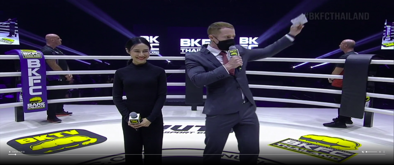
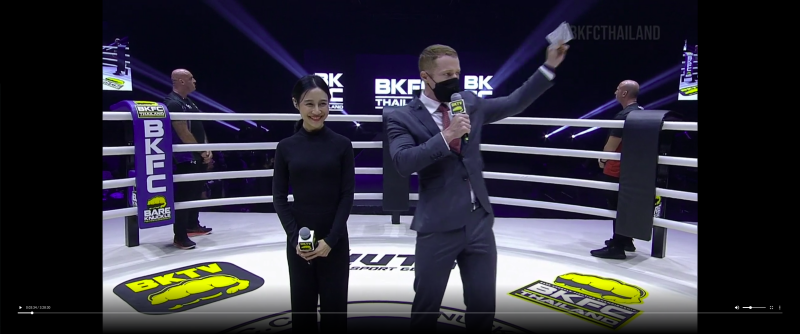

# BKTV Video player fixes

This Chrome extension includes two fixes for the Bare Knuckle TV video player.

## 1. Fix the aspect ratio of full screen video
[fixFullScreen.css](extensionCode/fixFullScreen.css)

BKTV stretches the video stream on full screen view. If your monitor is not 16:9, this will result in a distorted image. People will appear wide and short.

This is fixed by forcing the width of the video to be 1.78 times that of its height. (If you have a 4:3 screen, I'm sorry, this is not your fix.)

## 2. Fix the *'Continue Watching'*-feature
[fixContinueWatching.js](extensionCode/fixContinueWatching.js)

This feature should work by appending `?playStart=n` to the video URL, where `n` is the amount of seconds at which you wish to continue.

This doesn't seem to work, however, as the play starts at 0 seconds regardless.

This is fixed by injecting a snippet of javascript on the page, which tells the video player to load the video at the correct time stamp. 

To start the video, **first click on the seek bar** at the pre-loaded location and **then click the play-button**. Clicking the play-button alone does not seem to start the playback.

## How to install

1. In Chrome, navigate to `chrome://extensions`  

2. Activate developer mode using the toggle on the top right.  
  

3. Click the "Load unpackaged"-button that just popped up and select `./extensionCode`-folder from this repo.

4. Extension is now enabled. Reload auth0 site if it does not work.  

-------
## Before and after
  
-Before

  
-After